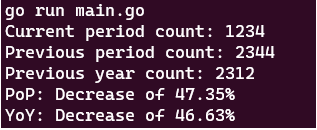

# goCalc

Calculates the period-over-period (PoP) and year-over-year (YoY) change in counts.

## Prequisites

- Go version 1.23.0 (although newer versions will likely work)

### Optional

- Make -- allows the use of the Makefile to make working with easier

## Why

This was something I needed to use often enough that a simple tool was needed.
